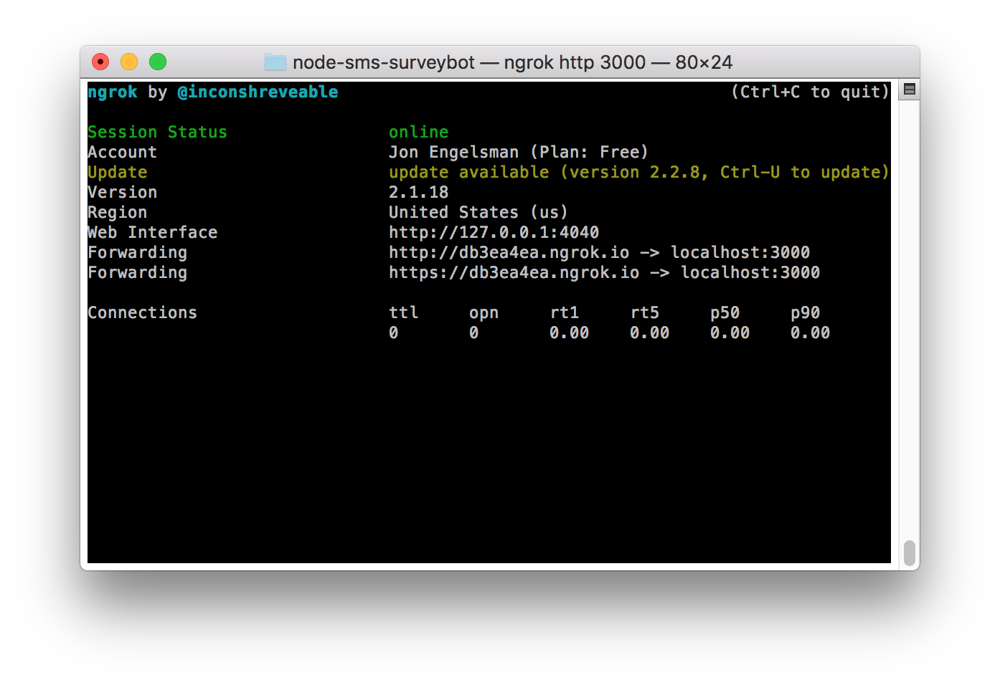

# node-sms-surveybot
This was a one-day challenge to build out a service that sends out custom SMS surveys and uploads responses to Google Spreadsheets using Node, Twilio and ngrok/AWS. It builds on my love for all things SMS and Twilio, with some prior experience of building out simple Node.js/Express services. 

# Introduction
I was challenged by my partner to find a way to record survey questions for users in a workplace situation, to help someone trying to find their way around or not being able to find something. The scope of the project was to build out an automated survey system that would ask the user a couple of questions about their current situation and record their responses in a Google Spreadsheet for later analysis. 

Oddly enough, this was my second mini-project prototyping an automated service in the field of workplace design, the [first one]() being a web app showing data of room occupancy using the [density.io](https://www.density.io/) API. 

# SurveyBot
Enter SurveyBot! It's a Node.js/Express app that sends survey questions as SMS messages using Twilio and then records responses in a Google Spreadsheet. To keep track of where it is in a conversation flow and send the right questions and record the corresponding answers, it uses Express sessions and a (painfully) simple message counter. 

The idea here is that you could deploy a really simple automated survey system with relatively little overhead. While there are paid services out there that do this, this is for people who want to go the simple, quick and custom route.

To setup SurveyBot, you'll need to do the following... 
* Create a *config.json* file that looks like this:
`
{
	"SESSION_SECRET": "something-secret",
	"GOOGLE_SHEET_ID": "googly-id"
}
`
* Create a *google_spreadsheet_credentials.json* (see below)
* Set up a Twilio account, get a phone number and create a TwiML app
* Follow the instructions below!

Other than that, you can customize the survey questions, data recorded in the Google Spreadsheet, etc but that requires a bit more editing of code. If you want to stick to a two question survey and only record the question and answer in your spreadsheet, you can just edit the copy text in *custom_message.json*. Beyond that, you'll have to start changing code in *app.js* and *spreadsheet.js*. 

For more information on how Google Spreadsheet editing was incorporated, how to run this Node.js app (locally, using ngrok and then on AWS EC2), and finally how to get it set up on Twilio, see below!

# Google Spreadsheets 
As usual, Twilio has some great support documentation and, lucky for me, they even had a [2017 blog post](https://www.twilio.com/blog/2017/03/google-spreadsheets-and-javascriptnode-js.html) on how to update Google Spreadsheets using Node.js! 

I pretty followed their instructions to set up the Google Spreadsheet updating functionality for this survey app. All I really did was change the name of the .json credentials file to *google_spreadsheet.json*, get the ID of the Google Spreadsheet I wanted to use and wrap the google-spreadsheet function calls I used into async steps using the 'async' NPM package.

The only other tricky thing to keep in mind is make sure that the key names of the object you send to the addRow function match exactly with the header names in your Google Spreadsheet. That being said, I wasted a lot of time troubleshooting callback errors in the `google-spreadsheet` package because I mixed up function calls between a 'document' and a 'sheet', so uhhh don't do that.

Assuming you've got your row update object key names right, your credential file all lined up and the right Google Spreadsheet ID, you should be good to go! You could test this part using direct function calls, or you can test it once you get the Node.js app server up and running.

# Running Locally (without Twilio)
To run this service locally, just do the standard...

`node app.js`

Running locally at first is helpful to troubleshoot the sequencing of survey questions and responses without having to go through Twilio each time.  You can test it out by sending POST HTTP requests to localhost:[PORT] using curl or an API manager like Postman or Insomnia. 

# Running local w/ ngrok
Next, you'll want to test out the SMS interactions in Twilio! Twilio needs access to a publically exposed endpoint and the easiest way to do that is using ngrok. Make sure ngrok is installed and run it locally, making sure to use the same port number defined in the *app.js* file.

`ngrok http [PORT]`

You should see the standard ngrok monitor start running!

You can test out that the ngrok forwarding URL is publically accessible similar to how you did it above.

If it's running ok and you can see responses from the POST HTTP requests to your /sms endpoint, then it's time to add in Twilio and SMS messaging!

# SMS and Twilio
I'm not going to go into the full setup of getting a phone number with Twilio and all of that. They have great support documentation and an easy-to-use interface so it should be a breeze!

For this project, we're just concerned with setting up a TwiML app. The best place to start is Twilip's support page, [How Do I Create a TwiML App?](https://support.twilio.com/hc/en-us/articles/223180928-How-Do-I-Create-a-TwiML-App-). 

After that, all you need to do is to copy your ngrok URL (e.g. https://db3ea4ea.ngrok.io/sms) into the Messaging Request URL box, making sure that HTTP POST is selected.

And finally, just make sure that the TwiML app you just created is properly [linked to your Twilio phone number](https://support.twilio.com/hc/en-us/articles/223136047-Configuring-Phone-Numbers-to-Receive-SMS-Messages#twimlbin). 

That should be about it! If you send a text message to your Twilio number, it should initiate the survey interaction! And (hopefully), you should see your responses populate in the Google Spreadsheet.

# Running on AWS EC2
Running locally with ngrok is great and all, but it won't work if you're looking to run the survey for a long period of time. To do that, one of your options would be to deploy this Node.js app to a persistent server, like an EC2 instance on AWS.

Luckily, I found that this Medium write-up was very thorough in helping me get this Node.js app up and running on EC2! 

[Setting up a Node.js app on a Linux AMI on an AWS EC2 instance with Nginx](https://medium.com/@nishankjaintdk/setting-up-a-node-js-app-on-a-linux-ami-on-an-aws-ec2-instance-with-nginx-59cbc1bcc68c))

Once you've got your app running on a publically-exposed EC2 instance, you can test it out again using curl or Postman. 

After that, all you need to do is change the Messaging Request URL for your TwiML app (via the Twilio console) and use the Public DNS URL for your EC2 instance, making sure to include the correct port that you configured (matching both the Node.js app and your Inbound rules for the EC2 Security Group) and don't forget the /sms endpoint!

# SurveyBot is alive!
And with that, you should have a simple, persistent, automated SMS-based survey service that records answers to Google Spreadsheets! Hopefully that's what you were trying to accomplish.
